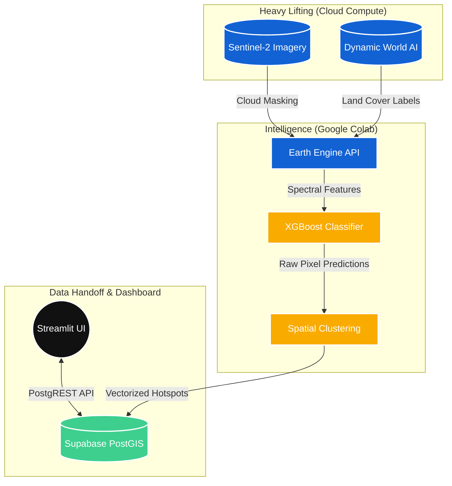
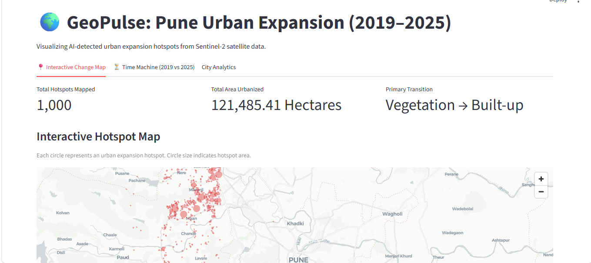
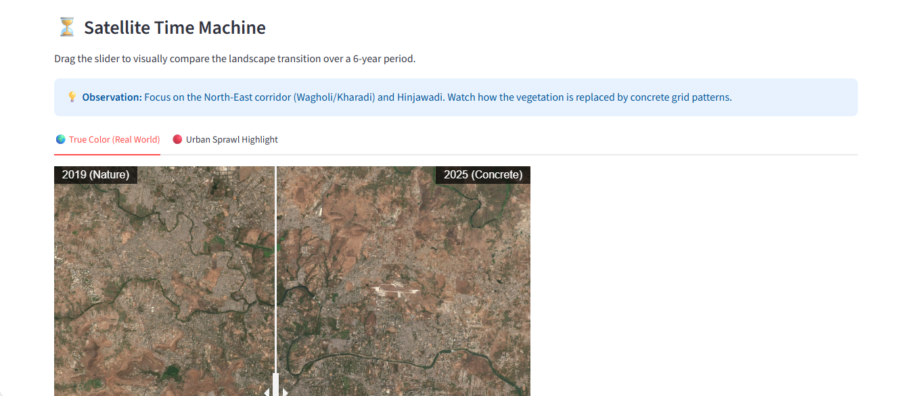
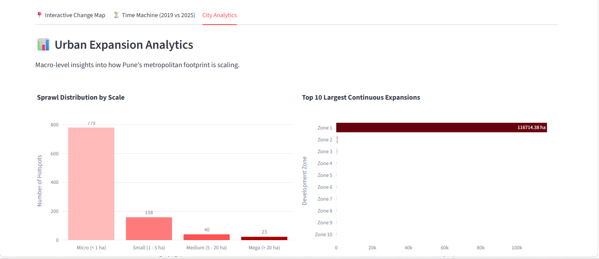

# 🌍 GeoPulse

### _Spatio-Temporal AI for Urban Change Intelligence_

<div align="center">

_Automated Satellite Telemetry, XGBoost Classification, and WebGL Spatial Analytics_

<br/>

[](https://geopulse-app.streamlit.app/)


</div>

---

# 📌 Overview

**GeoPulse** is a geospatial intelligence prototype that automates the first-pass analysis of urban land-cover change. Focused on the **Pune Metropolitan Region (2019–2025)**, it transforms raw satellite pixels into actionable business and geographic insights.

Cities change continuously, but manually identifying and quantifying these changes across massive geographic regions requires hundreds of hours of GIS analysis. GeoPulse replaces this manual workflow with an automated **Extract, Transform, and Load (ETL)** spatial pipeline.

Rather than just producing a static map, GeoPulse acts as a dynamic **Urban Intelligence Orchestrator** capable of:

- Extracting and processing petabytes of Sentinel-2 satellite imagery via Google Earth Engine.
- Engineering spectral features (NDVI, NDBI, NDWI) and analyzing 10 m resolution temporal composites.
- Deploying XGBoost and Google Dynamic World AI to confidently classify vegetation-to-concrete transitions.
- Clustering changes using DBSCAN to generate distinct, measurable expansion hotspots.
- Serving real-time spatial analytics through a blazing-fast WebGL (PyDeck) dashboard.

---

# ✨ What Makes This System Different

Most remote sensing projects stop at generating a pretty picture in a Python notebook. GeoPulse goes further by aggregating raw spectral pixels into an enterprise-ready dashboard.

### Core Innovations

✅ **Scientific Cloud Masking & Compositing:** Does not compare random satellite scenes. Uses cloud probability masking and seasonal compositing to ensure harvested crops aren't mistakenly classified as new concrete. <br/>
✅ **Hybrid AI Feature Engineering:** Merges pure mathematical spectral indices (ΔNDVI, ΔNDBI) with Google Dynamic World's pre-trained 9-class land-cover probabilities to feed the XGBoost model. <br/>
✅ **Raster-First DBSCAN Clustering:** Eliminates server timeouts by counting connected pixels on the cloud before vectorizing them into distinct hotspot polygons. <br/>
✅ **PostGIS Spatial Indexing:** Built on a Supabase PostgreSQL backend utilizing the PostGIS extension and GIST indexing, allowing the frontend to instantly query thousands of geometries. <br/>
✅ **GPU-Accelerated Rendering:** Bypasses sluggish HTML-based maps (Folium) by using PyDeck to render millions of data points directly via the user's graphics card at 60 FPS. <br/>

---

# 🏗️ High-Level Architecture



---

# 🧠 The Machine Learning & GIS Pipeline

GeoPulse utilizes a three-tier analysis system to isolate genuine urban growth from seasonal noise.

### 1. Spectral Change Detection

The system processes true-color imagery into mathematical features. For example, it calculates the Normalized Difference Vegetation Index (NDVI) to isolate plant health:

`NDVI = (NIR - Red) / (NIR + Red)`

By subtracting the 2019 indices from the 2025 indices (ΔNDVI, ΔNDBI), the pipeline creates a mathematical footprint of deforestation and concrete pouring.

### 2. AI Pseudo-Labeling & Classification

Instead of manually drawing thousands of training polygons, GeoPulse utilizes high-confidence pseudo-labels derived from Google Dynamic World. The XGBoost algorithm is trained on a stratified, perfectly balanced dataset to classify vegetation-to-built transitions, effectively eliminating class imbalance issues.

### 3. Spatial Optimization (The Vectorization Trap)

To avoid standard `Compute capacity exceeded` timeouts, GeoPulse executes a Raster-First filtering strategy. It uses `connectedPixelCount` to group pixels and drop microscopic anomalies _before_ reducing them to heavy geometric vectors (polygons). These simplified vectors are then pushed to the database.

---

# 🗄️ Database Architecture

The backend leverages a Supabase PostgreSQL database optimized for spatial queries using the **PostGIS** extension.

### Core Table: `urban_hotspots`

| Column             | Type                      | Purpose                                          |
| ------------------ | ------------------------- | ------------------------------------------------ |
| `id`               | `uuid`                    | Primary Key                                      |
| `geom`             | `geometry(Polygon, 4326)` | Stores WGS84 spatial coordinates for web mapping |
| `area_hectares`    | `numeric`                 | Calculated footprint of the urban expansion      |
| `change_type`      | `text`                    | e.g., 'Vegetation/Soil to Built-up'              |
| `confidence_score` | `numeric`                 | XGBoost prediction confidence                    |

_Security Note:_ The database utilizes **Row Level Security (RLS)**. The public Streamlit app is granted `SELECT` access, while only authenticated Colab service roles can `INSERT`, `UPDATE`, or `DELETE` the pipeline data.

---

# 📸 Product Walkthrough & Screenshots

## 1️⃣ Interactive Change Map (PyDeck)

A lightning-fast, WebGL-accelerated map plotting the geographic centroids of over 6,000+ distinct urban expansion hotspots. The radius of each point dynamically scales based on the hectares of land developed.

<p align="center">
  
</p>

---

## 2️⃣ Satellite Time Machine

A zero-reload interactive swipe tool. Recruiters and city planners can toggle between True Color (RGB) and High-Contrast Vegetation Index views to physically watch the concrete replace the natural landscape between 2019 and 2025.

<p align="center">
  
</p>

---

## 3️⃣ Urban Expansion Analytics

Macro-level business intelligence. Interactive Plotly charts categorize the sprawl by scale (Micro to Mega developments) and isolate the top 10 largest continuous concrete expansions within the metropolitan region.

<p align="center">
  
</p>

---

# ⚙️ Tech Stack

| Layer                   | Technologies                                         |
| ----------------------- | ---------------------------------------------------- |
| **Frontend Framework**  | Streamlit                                            |
| **Mapping Engine**      | PyDeck (deck.gl WebGL), Folium                       |
| **Data Visualization**  | Plotly Express                                       |
| **Machine Learning**    | XGBoost, DBSCAN (Scikit-Learn)                       |
| **Spatial Processing**  | GeoPandas, Shapely, Rasterio, geemap                 |
| **Cloud Compute (ETL)** | Google Earth Engine API, Google Colab                |
| **Spatial Database**    | Supabase PostgreSQL, PostGIS                         |
| **Satellite Imagery**   | Sentinel-2 Surface Reflectance, Google Dynamic World |

---

# 🚀 Deployment Guide

## 1️⃣ Configure Environment Variables

Create a `.streamlit/secrets.toml` file in your dashboard directory:

```toml
SUPABASE_URL = "your_supabase_url"
SUPABASE_KEY = "your_supabase_anon_key"

```

## 2️⃣ Database Initialization

Run the provided SQL script in your Supabase SQL Editor to enable PostGIS, create the `urban_hotspots` table, establish the GIST spatial index, and enforce Row Level Security policies.

## 3️⃣ Data Pipeline (Google Colab)

1. Authenticate with Google Earth Engine.
2. Execute Phase 1 & 2 to generate Cloud-Masked Composites and Spectral Indices.
3. Run Phase 3 to train the XGBoost classifier and generate Vector Polygons.
4. Provide your Supabase Service Role Key and execute Phase 4 to push the simplified geometries to your cloud database.

## 4️⃣ Dashboard Deployment

Deploy the `app.py` script directly to **Streamlit Community Cloud**, connecting it to your GitHub repository and injecting your secrets via the deployment settings.

---

# 📈 Future Roadmap

- [ ] Implement an LLM Natural Language explanation layer for macro-transitions.
- [ ] Integrate Copernicus DEM to analyze expansion based on terrain slope.
- [ ] Shift from descriptive analytics to predictive Urban Growth Forecasting.
- [ ] Enable user-defined arbitrary bounding boxes for multi-city analysis.

---

# 👨‍💻 Author

## Shubham Sharma

_MBA — Business Analytics_

Building intelligent systems at the intersection of:

- Geospatial Data Engineering
- Predictive Machine Learning
- Remote Sensing & Spatial Analysis
- Enterprise Software Architecture
- Data Visualization

---
